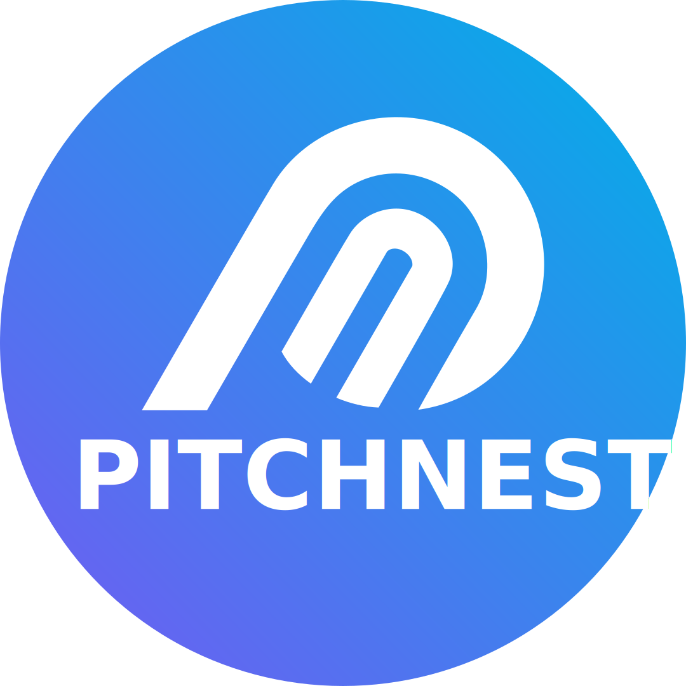

<p align="center">
  
</p>

<h1 align="center">PitchNest</h1>
<p align="center">
  <strong>AI-Powered Pitch Simulation Platform for Startup Founders</strong>
</p>

<p align="center">
  <a href="#features"></a>
  <a href="#tech-stack"></a>
  <a href="#license"></a>
</p>

---

## Overview

PitchNest is a real-time, multimodal AI platform that simulates a high-stakes venture capital boardroom. Founders can practice, refine, and perfect their pitches by presenting to AI investor personas that listen, ask tough questions, and debate ideas — all in real-time using voice, video, and screen sharing.

## Features

- **Real-Time Conversational AI** — Talk naturally with AI investor personas. The system handles interruptions gracefully and responds with ultra-low latency via WebSockets.
- **Multimodal Vision** — Gemini processes a live feed of your webcam and screen share. It reads your slides, catches you reading from a script, and provides contextual feedback.
- **Dynamic Investor Personas** — Multiple AI personas with distinct personalities (e.g., a ruthless VC demanding hard numbers vs. a supportive coach refining your narrative).
- **Deck-Aware Intelligence** — Upload your pitch deck (PDF) and the AI reads it, asking slide-specific questions about TAM, unit economics, and go-to-market strategy.
- **Post-Pitch Analytics** — After each session, receive a comprehensive evaluation report scoring delivery, clarity, scalability, and investor readiness.
- **Session Recording & Replay** — Review past pitch sessions with full transcript and AI commentary.
- **Secure Sharing** — Share pitch reports with co-founders, mentors, or accelerators via unique shareable links.

## Tech Stack

| Layer | Technology |
|-------|-----------|
| **Frontend** | React, Vite, TypeScript, Tailwind CSS v4, Framer Motion, Recharts |
| **Backend** | Node.js, Express, TypeScript |
| **AI Engine** | Google Gemini 2.0 Flash (Live WebSocket + REST API) |
| **Database** | Supabase (PostgreSQL) |
| **Auth** | JWT-based authentication |
| **Real-Time** | WebSockets (`ws`) bridging audio/video to Gemini Live API |

## Project Structure

```
PitchNest-Live/
├── frontend/               # React SPA (Vite)
│   ├── src/
│   │   ├── components/     # Reusable UI components
│   │   ├── contexts/       # Auth, Theme, Socket providers
│   │   ├── pages/          # Route-level page components
│   │   └── lib/            # Utilities
│   └── public/             # Static assets
├── backend/                # Node.js API server
│   ├── src/
│   │   ├── controllers/    # Route handlers
│   │   ├── services/       # AI, storage, evaluation logic
│   │   ├── sockets/        # WebSocket handlers (Gemini Live)
│   │   ├── middleware/      # Auth, error handling
│   │   └── config/         # Supabase, environment config
│   └── server.ts           # Entry point
└── README.md
```

## Getting Started

### Prerequisites

- **Node.js** v18 or higher
- **npm** v9 or higher
- A **Gemini API Key** ([Get one here](https://aistudio.google.com/app/apikey))
- A **Supabase** project ([Create one here](https://supabase.com))

### Installation

1. **Clone the repository**
   ```bash
   git clone https://github.com/immanex/PitchNest-Live.git
   cd PitchNest-Live
   ```

2. **Install dependencies**
   ```bash
   # Backend
   cd backend
   npm install

   # Frontend
   cd ../frontend
   npm install
   ```

3. **Configure environment variables**

   Copy the example env file and fill in your keys:
   ```bash
   cd backend
   cp .env.example .env
   ```

   Required variables:
   | Variable | Description |
   |----------|-------------|
   | `GEMINI_API_KEY` | Your Google Gemini API key |
   | `SUPABASE_URL` | Your Supabase project URL |
   | `SUPABASE_ANON_KEY` | Your Supabase anonymous key |
   | `JWT_SECRET` | A strong random secret for JWT signing |
   | `ALLOWED_ORIGIN` | Frontend URL (default: `http://localhost:5173`) |

4. **Set up the database**

   Run the following SQL in your Supabase SQL editor to create the required tables:

   - `users` — User accounts and profiles
   - `sessions` — Pitch session metadata and scores
   - `decks` — Uploaded pitch deck references
   - `waitlist` — Early access waitlist entries

### Running Locally

Open two terminal windows:

**Terminal 1 — Backend:**
```bash
cd backend
npm run dev
```

**Terminal 2 — Frontend:**
```bash
cd frontend
npm run dev
```

Open [http://localhost:5173](http://localhost:5173) in your browser. Allow camera and microphone permissions when prompted.

## Usage

1. **Sign up** and complete the onboarding flow
2. **Upload your pitch deck** (PDF format)
3. **Start a pitch session** — select difficulty level and investor personas
4. **Present your pitch** using voice and/or video
5. **Receive feedback** — get scored on delivery, clarity, and investor readiness
6. **Review analytics** — track improvement across sessions

## Environment Variables

See [`.env.example`](backend/.env.example) for a complete list of configuration options.

## Contributing

1. Fork the repository
2. Create a feature branch (`git checkout -b feature/your-feature`)
3. Commit your changes (`git commit -m 'Add your feature'`)
4. Push to the branch (`git push origin feature/your-feature`)
5. Open a Pull Request

## License

This project is licensed under the MIT License. See [LICENSE](LICENSE) for details.

## Contact

- **Email:** pitchnest@gmail.com
- **WhatsApp:** [+234 905 871 8400](https://wa.me/2349058718400)
- **Twitter/X:** [@PitchNest](https://x.com/PitchNest)

---

<p align="center">
  Built with ❤️ by the PitchNest team
</p>
